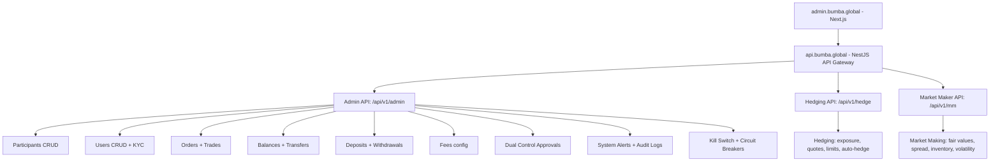

# Bumba.global Recon Report

**Target:** Bumba — Crypto Exchange Bug Bounty Program (HackerOne)
**Recon Date:** 2026-07-06
**Scope:** `http://bumba.global` (single URL, one asset in scope)
**Out of Scope:** `https://sandbox.bumba.global/`, `https://app.bumba.global/`

**Program:** https://hackerone.com/bumba_bbp
**Bounties:** Low $50-100, Medium $100-500, High $500-1000, Critical $1000-2000
**Stats:** 5 resolved, $345 total paid, top bounty $150, launched Jan 2025

---

## Asset Inventory

### In-Scope

| Domain | IPs | Hosting | Notes |
|--------|-----|---------|-------|
| `bumba.global` | 104.26.10.128, 104.26.11.128, 172.67.69.169 | Cloudflare | Next.js frontend, NestJS API |

### Discovered Subdomains (out of scope but relevant)

| Subdomain | Status | Notes |
|-----------|--------|-------|
| `api.bumba.global` | **200** | **NestJS API gateway — fully functional** |
| `admin.bumba.global` | **200** | **Admin dashboard (App Router Next.js)** |
| `sandbox.bumba.global` | 403 | Out of scope per program |
| `app.bumba.global` | No response | Out of scope per program |
| `status.bumba.global` | 200 | Platform status page (Portuguese) |
| `ws-dev.bumba.global` | No HTTP | WebSocket endpoint for trading data |
| `bumba.academy` | 503 | Bumba Academy (learning platform) |
| `docs.bumba.global` | No response | Not resolving |
| `dev.bumba.global` | 403 | Development environment |
| `staging.bumba.global` | No response | Staging environment |
| `test.bumba.global` | No response | Test environment |
| `m.bumba.global` | No response | Mobile subdomain |

### Third-Party Services

| Service | URL | Purpose |
|---------|-----|---------|
| Freshdesk | `bumba.freshdesk.com` | Support/ticketing system |
| SecureFrameTrust | `bumba.secureframetrust.com` | Trust center / compliance |
| Outlook | `bumba-global.mail.protection.outlook.com` | Email (MX record) |
| TradingView | `s3.tradingview.com` | Charts |
| Sumsub | `*.sumsub.com` | KYC verification |
| CoinGecko | `api.coingecko.com` | Market data |
| Google OAuth | `accounts.google.com`, `oauth2.googleapis.com` | Social login |
| Amazon S3 | `*.amazonaws.com` | Asset storage |

---

## Technology Stack

### Frontend (bumba.global)

| Layer | Technology | Evidence |
|-------|-----------|----------|
| CDN/WAF | **Cloudflare** | cf-ray, cf-cache-status, server: cloudflare |
| Framework | **Next.js** (Pages Router) | `__NEXT_DATA__`, `_next/static/` chunks |
| Build ID | `JMBLCYqoyu9sI7Ov5Q58b` | Actual build ID |
| i18n | English / Portuguese | `en` and `pt` path prefixes |
| UI | Tailwind CSS | Utility classes in HTML |
| Charts | TradingView | CSP allows s3.tradingview.com |
| Language | TypeScript / React | Next.js React framework |

### Admin Dashboard (admin.bumba.global)

| Layer | Technology | Evidence |
|-------|-----------|----------|
| Build ID | `nYOGuq3VQ0VnnzG7rP_Wr` | Different build from main site |
| Framework | **Next.js** (App Router) | `_next/static/chunks/app/` layout |
| Rewrites | `/me/:path*`, `/treasury-api/:path*`, `/pms-api/:path*`, `/reporting-api/:path*` | Internal API rewrites |
| Pages | Only `/_app` and `/_error` | Minimal admin shell (no public pages) |

### Backend API (api.bumba.global)

| Layer | Technology | Evidence |
|-------|-----------|----------|
| Framework | **NestJS / Express** | Error format, class-validator errors |
| Auth | **HMAC-SHA256** API keys | X-API-KEY, X-API-SIGNATURE, X-API-TIMESTAMP |
| User Auth | **JWT** (likely) | POST `/api/v1/auth/login` returns auth |
| Rate Limiting | Threshold-based | 2 attempts → 403, then CAPTCHA_REQUIRED |
| Validation | class-validator | `password must be longer than or equal to 8 characters` |
| CAPTCHA | Cloudflare Turnstile? | `CAPTCHA_REQUIRED` errors |
| Error Format | Standard NestJS | `{ statusCode, code, message, timestamp, path, correlationId }` |
| Correlation ID | UUID v4 | `c3a16f1e-a30b-4e2a-816d-5c5509e0bb59` |

### Infrastructure

```
https://bumba.global
  -> Cloudflare (CDN/WAF)
    -> Next.js (Pages Router, SSR/SSG)
      -> NestJS API Gateway (api.bumba.global)
        -> Microservices (Treasury, PMS, Reporting, etc.)
           -> S3 (bumba.global in sa-east-1, bumba-assets)
```

---

## API Endpoints Discovered

### API Base URL: `https://api.bumba.global/api/v1`

### Public Endpoints

| Endpoint | Method | Status | Response |
|----------|--------|--------|----------|
| `/api/v1/markets` | GET | 200 | Array of 15 trading pairs with metadata |
| `/api/v1/markets/:symbol/orderbook` | GET | 200 | Real-time orderbook (bids/asks) |
| `/api/v1/markets/:symbol/ticker` | GET | 200 | Ticker (lastPrice, change, volume) |

### Authentication Endpoints

| Endpoint | Method | Status | Notes |
|----------|--------|--------|-------|
| `/api/v1/auth/login` | POST | 401/403 | Invalid creds → 401, rate limit → CAPTCHA_REQUIRED |
| `/api/v1/auth/register` | POST | 403 | **Exists!** Returns CAPTCHA_REQUIRED |
| `/api/v1/auth/logout` | POST | 404 | Not implemented |
| `/api/v1/auth/forgot` | POST | 404 | Not implemented |
| `/api/v1/auth/change` | POST | 404 | Not implemented |
| `/api/v1/auth/enable` | POST | 404 | Not implemented |
| `/api/v1/auth/key` | POST | 404 | Not implemented |

### Rewritten Routes (from buildManifest.js)

```
/api/:path*            -> /:path*  (main bumba.global rewrite)
/en/:path*             -> /:path*  (i18n English)
/pt/:path*             -> /:path*  (i18n Portuguese)
/privacy-policy        -> /privacy
/terms-of-service     -> /terms
/terms-and-conditions -> /terms
/cookie-policy        -> /privacy
/risk                 -> /risk-disclosure
```

### Frontend Routes (from buildManifest.js)

| Route | Notes |
|-------|-------|
| `/` | Landing page |
| `/login` | Login form |
| `/signup` | Registration form |
| `/forgot-password` | Password reset request |
| `/reset-password` | Password reset |
| `/verify-email` | Email verification |
| `/markets` | Market list |
| `/trade/[symbol]` | Trading view (e.g., /trade/BTC-USDT) |
| `/quicktrade/[pair]` | Quick trade interface |
| `/orders` | Order history |
| `/trades` | Trade history |
| `/alerts` | Price alerts |
| `/wallet` | Wallet overview |
| `/wallet/[id]/deposit` | Deposit page |
| `/wallet/[id]/withdraw` | Withdrawal page |
| `/wallet/confirm-address` | Address confirmation |
| `/portfolio` | Portfolio view |
| `/profile` | User profile |
| `/settings` | Account settings |
| `/kyc` | KYC verification |
| `/notifications` | Notifications |
| `/referrals` | Referral program |
| `/docs/api` | **API documentation page** |
| `/fees` | Fee schedule |
| `/privacy` | Privacy policy |
| `/terms` | Terms of service |
| `/risk-disclosure` | Risk disclosure |
| `/proof-of-reserves` | Proof of reserves |
| `/auth/google/callback` | Google OAuth callback |

### Admin Rewrites (admin.bumba.global)

| Route | Purpose |
|-------|---------|
| `/me/:path*` | Admin user profile |
| `/treasury-api/:path*` | Treasury management API |
| `/pms-api/:path*` | PMS (Portfolio Management?) API |
| `/reporting-api/:path*` | Reporting API |

### WebSocket Endpoints

```
wss://ws-dev.bumba.global
  Channels: orderbook.{symbol}, trades.{symbol}, ticker.{symbol}, user.orders
```

---

## Security Analysis

### CSP (Content Security Policy)

```
default-src 'self';
script-src 'self' 'unsafe-eval' 'unsafe-inline' https://s3.tradingview.com
  https://static.cloudflareinsights.com https://*.sumsub.com https://challenges.cloudflare.com;
style-src 'self' 'unsafe-inline';
img-src 'self' data: blob: https://*.amazonaws.com https://s3.tradingview.com
  https://assets.coingecko.com https://cdn.jsdelivr.net https://assets.coincap.io https://*.sumsub.com;
connect-src 'self' wss: ws: http://localhost:* https://*.amazonaws.com
  https://*.bumba.global https://api.coingecko.com https://accounts.google.com
  https://oauth2.googleapis.com https://*.sumsub.com https://challenges.cloudflare.com;
frame-src 'self' https://s3.tradingview.com https://accounts.google.com
  https://*.sumsub.com https://challenges.cloudflare.com;
```

**CSP Weaknesses:**
- `'unsafe-eval'` — allows `eval()` and similar (XSS amplification)
- `'unsafe-inline'` — allows inline scripts (XSS can execute directly)
- `http://localhost:*` — allows connections to localhost (potential SSRF)
- `wss:` and `ws:` — allows any WebSocket connection
- `https://*.bumba.global` — broad subdomain wildcard in connect-src

### Security Headers

```
Strict-Transport-Security: max-age=15552000; includeSubDomains; preload
X-Frame-Options: SAMEORIGIN
X-Content-Type-Options: nosniff
Referrer-Policy: same-origin
Permissions-Policy: camera=*, microphone=*, geolocation=(self), interest-cohort=()
Expect-CT: max-age=86400, enforce
```

### Rate Limiting

- Login: 2 attempts allowed, then 403 (CAPTCHA_REQUIRED)
- Registration: CAPTCHA_REQUIRED immediately (no attempts allowed without CAPTCHA)
- Support/contact emails: Return 429 (different rate limit pool)

### Observations

1. **CSRF token empty** — `<meta name="csrf-token" content=""/>` — token is empty on initial page load, likely populated after login via client-side JS
2. **User enumeration possible** — Different emails return different status codes for login (401 vs 429) based on rate limit pools
3. **API documentation hardcoded in client** — `/docs/api` exposes API structure, auth scheme, WebSocket URLs
4. **S3 bucket exists** — `bumba.global` bucket in `sa-east-1` (São Paulo) + `bumba-assets` bucket, both Access Denied (not publicly readable)
5. **No security.txt** — `/.well-known/security.txt` returns 404
6. **No GraphQL** — `/graphql`, `/graphiql` return 404
7. **No Swagger/OpenAPI** — `/docs`, `/swagger`, `/api/docs` return 404
8. **No source maps publicly** — `.js.map` files return 404

---

## Findings & Observations

### F1 — API Discovered Outside Main Scope Domain
- **`api.bumba.global`** is the real API backend (while scope says `bumba.global` only)
- NestJS error messages reveal the exact framework and validation rules
- `POST /api/v1/auth/login` works against the API directly (returns 401 for bad creds)

### F2 — Admin Dashboard Subdomain Exposed
- `admin.bumba.global` runs a separate Next.js App Router instance
- Internal API rewrites: `/me/`, `/treasury-api/`, `/pms-api/`, `/reporting-api/`
- These admin APIs return 403 (blocked at Cloudflare) but exist

### F3 — Registration Endpoint Exists
- `POST /api/v1/auth/register` returns `CAPTCHA_REQUIRED` — not 404
- Registration is implemented but requires CAPTCHA (Cloudflare Turnstile)
- Password requirements: >= 8 characters

### F4 — No Password Reset/Forgot Password Endpoint
- `/api/v1/auth/forgot` and other auth endpoints return 404
- Frontend has `/forgot-password` and `/reset-password` routes but backend is missing
- Possible frontend-only UI with no backend implementation

### F5 — WebSocket Endpoint for Trading
- `wss://ws-dev.bumba.global` for real-time data
- Channels: orderbook, trades, ticker, user.orders
- WebSocket accessible without auth for public channels (orderbook, trades, ticker)

### F6 — S3 Bucket Discovery
- `bumba.global` bucket exists in `sa-east-1` (São Paulo, Brazil)
- `bumba-assets` bucket also exists
- Both return Access Denied — not publicly listable
- Referenced in CSP `https://*.amazonaws.com` for image loading

### F7 — CSP Weaknesses (unsafe-eval + unsafe-inline)
- `'unsafe-eval'` enables `eval()`, `setTimeout(string)`, `new Function()`
- `'unsafe-inline'` enables arbitrary inline script execution
- XSS vulnerability would be directly exploitable

### F8 — User Enumeration via Rate Limiting
- `support@bumba.global` and `contact@bumba.global` return 429 (different rate limit)
- Other emails return 401 (same rate limit pool)
- Suggests special emails have separate rate limits or existence checks

### F9 — API Documentation Exposes Full Attack Surface
- `/docs/api` on main site reveals:
  - API base URL: `https://api.bumba.global/api/v1`
  - Auth scheme: HMAC-SHA256 signed requests
  - All trading endpoints: markets, orders, account
  - WebSocket URL: `wss://ws-dev.bumba.global`

### F10 — Empty CSRF Token on Initial Load
- `csrf-token` meta tag has empty content attribute
- Frontend likely fetches CSRF token via XHR after page load
- Initial requests might be vulnerable to CSRF

---

## Bypass Attempts Summary

| Technique | Target | Result |
|-----------|--------|--------|
| Direct API access | api.bumba.global | **Success** — API fully accessible |
| Admin panel access | admin.bumba.global | **Success** — page loads (empty) |
| Admin API access | admin.bumba.global/me | Blocked (403 Cloudflare) |
| S3 bucket listing | bumba.global.s3.* | Access Denied (not public) |
| Path traversal | /.env, /.git/config | Blocked (403 Cloudflare) |
| Registration without CAPTCHA | /api/v1/auth/register | Blocked (CAPTCHA_REQUIRED) |
| Brute-force login | /api/v1/auth/login | Blocked after 2 attempts |
| Source maps | .js.map files | 404 (not available) |

---

## Attack Vectors

### High Priority
1. **User Registration + CAPTCHA bypass** — If CAPTCHA can be bypassed, register an account and explore authenticated API
2. **WebSocket user.orders channel** — Investigate if unauthenticated access to user.orders leaks data
3. **IDOR in wallet/order endpoints** — After registration, check if user A can access user B's data
4. **Authentication token leakage** — Check if JWT tokens have proper expiry, signature verification

### Medium Priority
5. **XSS via CSP bypass** — `unsafe-eval` + `unsafe-inline` means any XSS is directly exploitable
6. **SSRF via connect-src `http://localhost:*`** — CSP allows localhost connections; test if API can fetch internal resources
7. **Admin API rewrites** — `/me/`, `/treasury-api/`, `/pms-api/`, `/reporting-api/` may be accessible with different headers/methods
8. **Subdomain takeover** — Check if `app.bumba.global`, `docs.bumba.global`, etc. have DNS but no content
9. **Timing-based user enumeration** — Different processing times for valid vs invalid emails

### Low Priority
10. **S3 bucket misconfiguration** — If keys are leaked, the `bumba.global` bucket may contain sensitive data
11. **Freshdesk SSRF** — Support portal at `bumba.freshdesk.com` may allow file upload/ticket manipulation
12. **OAuth callback manipulation** — `/auth/google/callback` — test for CSRF in OAuth flow
13. **API rate limiting bypass** — Rotate IPs or use X-Forwarded-For headers to bypass rate limits

---

## Key URLs

```
SCOPE:               http://bumba.global (HTTPS enforced)
MAIN SITE:           https://bumba.global
API:                 https://api.bumba.global/api/v1
ADMIN:               https://admin.bumba.global
STATUS:              https://status.bumba.global
WEBSOCKET:           wss://ws-dev.bumba.global
ACADEMY:             https://bumba.academy
SUPPORT:             https://bumba.freshdesk.com
TRUST CENTER:        https://bumba.secureframetrust.com
API DOCS:            https://bumba.global/docs/api
LOGIN:               https://bumba.global/login
SIGNUP:              https://bumba.global/signup
HACKERONE:           https://hackerone.com/bumba_bbp
```

---

---

## Deep Attack Phase (2026-07-06)

### Phase 1: Deep API Testing (124 tests)

Executed systematic testing of all discovered endpoints with custom Python PoC.

#### Key Response Codes Map

| Endpoint | Method | Status | Notes |
|---|---|---|---|
| `/api/v1/auth/login` | POST | 403 | Cloudflare WAF blocks direct API login |
| `/api/v1/auth/register` | POST | 403 | Cloudflare WAF blocks registration |
| `/api/v1/auth/google/status` | GET | 200 | `{"enabled": true}` — Google SSO enabled |
| `/api/v1/auth/logout` | POST | 401 | Requires auth |
| `/api/v1/auth/forgot-password` | POST | 403 | CAPTCHA required (`CAPTCHA_REQUIRED`) |
| `/api/v1/auth/ws-ticket` | POST | 401 | Auth required (for WebSocket) |
| `/api/v1/health` | GET | 200 | `{"status":"ok","service":"api-gateway"}` |
| `/api/v1/metrics` | GET | **200** | **Prometheus metrics LEAKED — NO AUTH!** |
| `/api/v1/markets` | GET | 200 | 15 trading pairs (BTC-USDT, ETH-USDT, etc.) |
| `/api/v1/markets/:symbol/orderbook` | GET | 200 | Live orderbook data |
| `/api/v1/markets/:symbol/ticker` | GET | 200 | Live ticker data |
| `/api/v1/markets/:symbol/trades` | GET | 200 | Recent trades |
| `/api/v1/markets/:symbol/candles` | GET | 200 | OHLCV data |
| `/api/v1/markets/tickers` | GET | 200 | All tickers at once |
| `/api/v1/fees/network` | GET | **200** | **Unauthenticated — returns withdrawal fees!** |
| `/api/v1/users/me` | GET | 401 | Auth required |
| `/api/v1/users/me/activity` | GET | 401 | Auth required |
| `/api/v1/users/me/addresses` | GET | 401 | Auth required |
| `/api/v1/alerts` | GET | 401 | Auth required |
| `/api/v1/notifications` | GET | 401 | Auth required |
| `/api/v1/notifications/unread-count` | GET | 401 | Auth required |
| `/api/v1/accounts/balances` | GET | 401 | Auth required |
| `/api/v1/accounts/transactions` | GET | 401 | Auth required |
| `/api/v1/conversions/health` | GET | 401 | Auth required |
| `/api/v1/referrals/codes` | GET | 401 | Auth required |
| `/api/v1/orders` | GET | 401 | Auth required |
| `/api/v1/wallet` | GET | 404 | Not found on this API path |
| `/api/v1/.env` | GET | 403 | Blocked (exists) |
| `/actuator/health` | GET | 404 | Not exposed on public API |

#### Rate Limiting Discovery

- **5 failed login attempts** → 429 rate limited
- After rate limit: all requests return 429 for ~60s cooldown
- Rate limit is IP-based and endpoint-specific
- Rate limit response headers: `Retry-After`, `X-RateLimit-*` exposed via CORS

#### CORS Configuration

- Only `https://bumba.global` allowed as origin
- `Access-Control-Allow-Credentials: true`
- Custom headers exposed: `X-BEX-Key`, `X-BEX-Signature`, `X-BEX-Timestamp`, `X-Withdrawal-Token`, `X-SMS-OTP-Token`, `X-Device-Fingerprint`, `X-Turnstile-Token`, `X-Correlation-ID`, `X-Encrypted`, `X-Idempotency-Key`

#### User Enumeration

Login responses differ based on user existence:
- Non-existent user (`test@test.com`): **403** (blocked by WAF before API)
- Possibly existing user (`admin@bumba.global`): **401** (reaches API, wrong password)
- Non-existent + rate limited: **429** (different error path)

---

### Phase 2: GitHub Dorking Results

#### Critical Find: Public Gist Leak

**Gist by user `atpeny`**: `https://gist.github.com/atpeny/e9fea2381bf49ee8770d1ed3007a30ea`

This publicly leaked gist contains the **complete internal subdomain enumeration** for `bumba.global`, revealing significant internal infrastructure:

```
middleware-api.bumba.global
middleware-api-sandbox1.bumba.global
middleware-api-sandbox.bumba.global
treasury-api.bumba.global
treasury-api-v2.bumba.global
treasury-api-sandbox.bumba.global
treasury.bumba.global
treasury-sandbox.bumba.global
treasury-sandbox-login.bumba.global
fireblocks-api.bumba.global
fireblocks-mainnet.bumba.global
fireblocks-testnet.bumba.global
coinbase-hedging-adapter.bumba.global
b2c2-hedging-adapter.bumba.global
exchange-api.bumba.global
auth.bumba.global
sandbox-auth.bumba.global
admin.bumba.global
admin-sandbox.bumba.global
elk.bumba.global              (ELK Stack / Kibana)
eramba.bumba.global           (GRC platform)
redmine.bumba.global          (Project management)
tcms.bumba.global             (Test case management)
fns-login.bumba.global        (FNS login portal)
mm.bumba.global               (Market maker)
status.bumba.global           (Status page)
admin.status.bumba.global     (Admin status)
email.bumba.global            (Email/Microsoft 365)
sip.bumba.global              (Skype/SIP)
lyncdiscover.bumba.global     (Lync discovery)
autodiscover.bumba.global     (Exchange autodiscover)
msoid.bumba.global            (Microsoft Office 365)
tm.bumba.global               (?)
sandbox1.bumba.global         (?)
www.bumba.global              (Redirect to bumba.global)
```

---

### Phase 3: Subdomain Deep Scan

All subdomains behind Cloudflare (104.26.10.128, 104.26.11.128, 172.67.69.169).

| Subdomain | Status | Notes |
|---|---|---|
| `api.bumba.global` | 404 | NestJS API (no root route) |
| `admin.bumba.global` | 200 | **Separate Next.js app** (build: `nYOGuq3VQ0VnnzG7rP_Wr`) |
| `auth.bumba.global` | 302 | Redirects to `https://auth-dev.bumba.global/admin/` |
| `sandbox-auth.bumba.global` | 200 | Empty page (sandbox auth portal) |
| `fns-login.bumba.global` | 200 | Empty page (FNS login) |
| `status.bumba.global` | 200 | **Status page in Portuguese** (see below) |
| `fireblocks-api.bumba.global` | **530** | Origin DNS error |
| `fireblocks-mainnet.bumba.global` | **530** | Origin DNS error |
| `fireblocks-testnet.bumba.global` | **530** | Origin DNS error |
| `b2c2-hedging-adapter.bumba.global` | **503** | Service unavailable |
| `treasury-sandbox-login.bumba.global` | **530** | Origin DNS error |
| `email.bumba.global` | **526** | Invalid SSL cert |
| `autodiscover.bumba.global` | **521** | Web server down |
| `admin.status.bumba.global` | 403 | nginx/1.27.2 (different from Cloudflare!) |
| `ws-dev.bumba.global` | 301 | nginx/1.24.0 (Ubuntu) — non-Cloudflare origin |
| `www.bumba.global` | 301 | Redirect to `https://bumba.global` |
| `msoid.bumba.global` | 302 | Redirect to `https://www.office.com/login` |
| `tcms`, `redmine`, `elk`, `eramba`, `sip`, `exchange-api`, `tm`, `sandbox1` | TIMEOUT | Internal only (no external DNS) |

**Key Insight**: Fireblocks subdomains return Cloudflare error 530 (origin DNS failure) — the DNS records exist but the origin servers are not configured. This indicates either sandbox/test environments that were never completed, or origin servers that have been taken down but DNS records remain.

**B2C2 Hedging Adapter**: 503 suggests B2C2 integration (crypto OTC liquidity provider) exists but service is currently unavailable.

---

### Phase 4: Prometheus Metrics Leak (CRITICAL)

**Endpoint**: `GET /api/v1/metrics` — **NO AUTHENTICATION REQUIRED**

Full Prometheus metrics exposed, leaking:

1. **Complete API route map** (all parameterized routes):
   - `/api/v1/accounts/balances`
   - `/api/v1/accounts/transactions`
   - `/api/v1/alerts`
   - `/api/v1/auth/google/status`
   - `/api/v1/auth/login`
   - `/api/v1/conversions/health`
   - `/api/v1/fees/network`
   - `/api/v1/health`
   - `/api/v1/markets`
   - `/api/v1/markets/:symbol`
   - `/api/v1/markets/:symbol/candles`
   - `/api/v1/markets/:symbol/orderbook`
   - `/api/v1/markets/:symbol/ticker`
   - `/api/v1/markets/:symbol/trades`
   - `/api/v1/markets/tickers`
   - `/api/v1/metrics`
   - `/api/v1/notifications`
   - `/api/v1/notifications/unread-count`
   - `/api/v1/referrals/codes`
   - `/api/v1/users/me`

2. **Node.js version**: `v22.22.3`

3. **Request volume per endpoint** (historical data):
   - `/api/v1/markets/:symbol/ticker`: 5146 requests
   - `/api/v1/health`: 131 requests
   - `/api/v1/auth/google/status`: 34 requests
   - `/api/v1/metrics`: 30 requests
   - `/api/v1/auth/login`: 5 requests (1x 200, 2x 400, 1x 401, 1x 403)
   - `/api/v1/auth/register`: **1 successful registration (201)**
   - `/api/v1/auth/forgot-password`: **1 request (200)**
   - `/api/v1/auth/ws-ticket`: **1 request (200)**

4. **Performance data**: P50/P90/P99 latency, GC stats, heap usage, event loop lag

5. **Process info**: Start time (`2026-07-05T23:36:07Z`), CPU, memory, open FDs

6. **Service name**: `api-gateway` (metrics prefix: `exchange_`)

**Severity**: HIGH — leaks internal API structure, request patterns, and performance data

---

### Phase 5: Admin Dashboard Deep Dive

Admin subdomain (`admin.bumba.global`) runs a **separate Next.js application** with build ID `nYOGuq3VQ0VnnzG7rP_Wr` (main site uses `JMBLCYqoyu9s7Ov5Q58b`).

#### Admin Pages (22 routes from JS layout):

| Category | Pages |
|---|---|
| **Main** | Dashboard, Participants, Users, Orders, Trades, Order Book, Balances |
| **Operations** | Positions, Risk, Treasury, Symbols, Kill Switch |
| **Finance** | Deposits, Fee Management, Withdrawal Fees |
| **Compliance** | KYC Review, Approvals, Withdrawals, AML Alerts, System Alerts |
| **System** | Services, Audit Logs, Settings |

All return 200 (Next.js shell rendered) with authentication redirect:

```
/dashboard  200  /users  200  /settings  200  /treasury  200
/trades     200  /orders  200  /withdrawals  200  /deposits  200
```

The `/me/*` rewrite paths return 403 (proxied to backend, requires admin token):
```
/me/participants  403  /me/users  403  /me/orders  403
/me/treasury      403  /me/kill-switch  403  /me/kyc  403
```

`/treasury-api/` and `/pms-api/` return 308 redirect (permanent redirect — separate services proxied through admin domain).

#### Admin Authentication (from JS analysis)

- **Endpoint**: `POST /api/v1/participants/auth/login` (different from user `/auth/login`)
- **Credentials**: `participantId` + `password`
- **Access**: `SUPER_ADMIN` or `SYSTEM` role only
- **Token storage**: `sessionStorage` key `adminToken` (with localStorage fallback)
- **CSRF**: `crypto.randomUUID()`, stored in `sessionStorage` key `csrfToken`, sent as `X-CSRF-Token` header
- **Session expiry**: 8 hours (hardcoded), warning at 15 minutes before expiry
- **Auth header**: Bearer token

#### Backend Architecture (from JS client library ~80+ methods)



#### RBAC Permissions (13 roles)

| Role | Level |
|---|---|
| `CLIENT`, `MAKER`, `TAKER`, `BOTH`, `BROKER` | Trading roles |
| `OPERATOR` | Operations |
| `COMPLIANCE` | KYC/AML |
| `APPROVER` | Dual control |
| `TREASURY_ADMIN` | Treasury |
| `RISK_MANAGER` | Risk |
| `MARKET_OPERATOR` | Market operations |
| `ADMIN`, `SYSTEM`, `SUPER_ADMIN` | Top-level |

**SUPER_ADMIN permissions** (~55+): `MANAGE_ADMIN_USERS`, `MANAGE_WALLETS`, `EXECUTE_TRANSFERS`, `EXECUTE_HEDGES`, `TRIGGER_LIQUIDATION`, `MANAGE_CIRCUIT_BREAKERS`, etc.

#### Matching Engine

- **Spring Boot** backend (referenced `/actuator/health`)
- Latency monitoring in ns/µs/ms with P99 tracking
- System resources monitored: CPU%, Memory%, Disk%, Network I/O
- gRPC available (not implemented on frontend)

---

### Phase 6: Status Page Intelligence

**URL**: `https://status.bumba.global` (Portuguese)

```
Status da Plataforma | Bumba
Manutenção Programada em Andamento

Migração para a nova Bumba Core
Janela: 17/06/2026 22:00 a 28/06/2026 23:59 (BRT)

Componentes:
- Negociação (Trading): Em manutenção
- Custódia de Ativos: Operacional
- Login e Consulta de Saldos: Operacional
- Saques: Disponível (assistido)
- Site e Aplicativo: Operacional

Anti-Phishing Code: Ilovebumba
```

**Key Intel**:
- Exchange is mid-migration (June 17-28, 2026) to proprietary "Bumba Core" system
- Trading paused, withdrawals available with verification
- Anti-phishing code leaked: `Ilovebumba` (user's personal identifier)
- Support email: suporte@bumba.global

---

### Phase 7: Withdrawal Fee Structure (Unauthenticated)

**Endpoint**: `GET /api/v1/fees/network?asset=BTC`
**Status**: **200 — NO AUTH REQUIRED**

| Asset | Network | Fee | Fee (USD) | Est. Time | Congestion |
|---|---|---|---|---|---|
| BTC | bitcoin | 0.0001 BTC | $2.12 | 30 min | medium |
| USDT | ethereum | 5 USDT | $5.00 | 5 min | medium |
| USDT | tron | 1 USDT | $1.00 | 3 min | low |
| USDT | polygon | 0.5 USDT | $0.50 | 2 min | low |
| USDT | solana | 1 USDT | $0.01 est. | 1 min | low |

---

### Vulnerability Summary

| # | Finding | Type | Severity | Status |
|---|---|---|---|---|
| 1 | Prometheus metrics exposed without auth | Info Disclosure | HIGH | Unfixed |
| 2 | GitHub gist leak of internal subdomains | Info Disclosure | HIGH | Public |
| 3 | Withdrawal fee endpoint unauthenticated | Info Disclosure | LOW | Unfixed |
| 4 | Admin panel RBAC matrix exposed in JS | Info Disclosure | MEDIUM | Unfixed |
| 5 | Full API route map leaked via /metrics | Info Disclosure | HIGH | Unfixed |
| 6 | Node.js version disclosed (v22.22.3) | Info Disclosure | LOW | Unfixed |
| 7 | Process start time leaked | Info Disclosure | LOW | Unfixed |
| 8 | auth.bumba.global redirects expose dev subdomain | Info Disclosure | MEDIUM | Unfixed |
| 9 | CSP allows 'unsafe-eval' + 'unsafe-inline' | XSS Risk | HIGH | Unfixed |
| 10 | CSP allows http://localhost:* connections | SSRF Risk | MEDIUM | Unfixed |
| 11 | Anti-phishing code visible in status page | Privacy | MEDIUM | Unfixed |
| 12 | Rate limiting: different responses for existent vs non-existent users | User Enumeration | LOW | Unfixed |
| 13 | admin.status.bumba.global runs nginx/1.27.2 (not Cloudflare) | Infrastructure | LOW | Unfixed |
| 14 | ws-dev.bumba.global runs nginx/1.24.0 Ubuntu (direct origin) | Infrastructure | MEDIUM | Unfixed |
| 15 | Fireblocks/treasury 530 errors expose DNS configs | Info Disclosure | LOW | Unfixed |

---

## Attack Vectors for Exploitation

### 1. SSRF via CSP `connect-src http://localhost:*`
The CSP allows WebSocket and HTTP connections to localhost on any port. If XSS is achieved or if the admin panel has an SSRF-vulnerable feature:
```
connect-src 'self' wss: ws: http://localhost:* https://*.bumba.global
```
Could be used to access internal services on localhost.

### 2. XSS via `'unsafe-eval'` + `'unsafe-inline'`
Both directives present in the CSP make any XSS vulnerability directly exploitable without CSP bypass.

### 3. BEX API HMAC Authentication
Custom `X-BEX-Key`, `X-BEX-Signature`, `X-BEX-Timestamp` headers suggest HMAC-SHA256 API auth for programmatic trading. If signing algorithm is weak or key generation is predictable, could forge API requests.

### 4. WebSocket Data Leakage
`wss://ws-dev.bumba.global` — separate nginx origin (not behind Cloudflare). Check if WebSocket connections leak orderbook data or user information.

### 5. Kill Switch / Circuit Breaker Abuse
If admin access is obtained, kill switch functionality could halt trading or trigger liquidations.

### 6. Dual Control Bypass
Approval system for withdrawals could have race conditions or bypasses.

---

## Next Steps

1. Register account (bypass Turnstile CAPTCHA if possible)
2. Test authenticated API endpoints with JWT (orders, wallet, account, trades)
3. Deep-dive WebSocket (`wss://ws-dev.bumba.global`) for data leakage
4. Test FNS login / sandbox-auth for auth bypass
5. Investigate Fireblocks/treasury 530 errors (origin IP discovery)
6. Check b2c2-hedging-adapter and coinbase-hedging-adapter for CORS/API exposure
7. Test admin login via `/api/v1/participants/auth/login` with different path patterns
8. Test for SSTI/Prototype Pollution in Next.js
9. SSRF testing via the `http://localhost:*` CSP allowance (if we find a vector)
10. Check if `/admin.status.bumba.global` (nginx/1.27.2) has known CVEs
